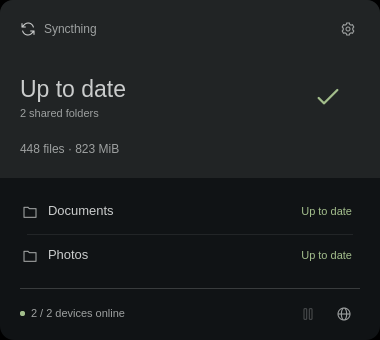

# Foamy Syncthing

Syncthing folder status and controls.



## Install

Install Syncthing (`syncthing`) and configure its user service. Disable any
other Syncthing shell plugin before enabling this one.

```sh
omarchy plugin add https://github.com/foamrider/foamy-syncthing.git --enable
```

## Use

- Left-click the widget to see folders and connected devices; right-click refreshes.
- Open the cog for language, device warnings, and folder actions.
- Use the globe to open Syncthing's Web UI.
- The footer play/pause button starts or stops the local Syncthing service.

**Pause** keeps a folder configured. **Unlink** asks for confirmation and removes
it from Syncthing while keeping local files. **Add folder** uses an existing
directory.

## License

Plugin code is [MIT-licensed](LICENSE), based on [Syncshell](LICENSE-SYNCSHELL)
and [Omarchy](LICENSE-OMARCHY). Bundled assets retain their own license notices.

Provided **as is**, without warranty or guaranteed support. Use at your own risk.
